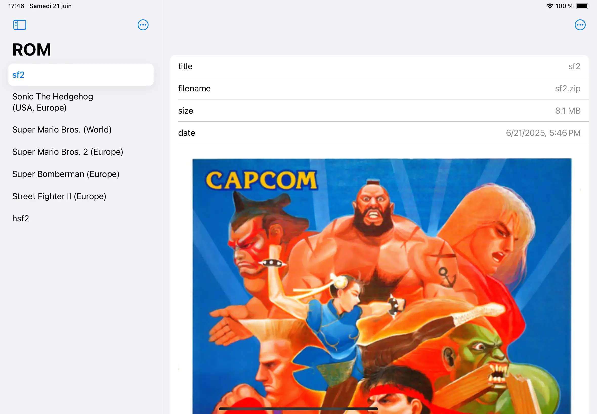
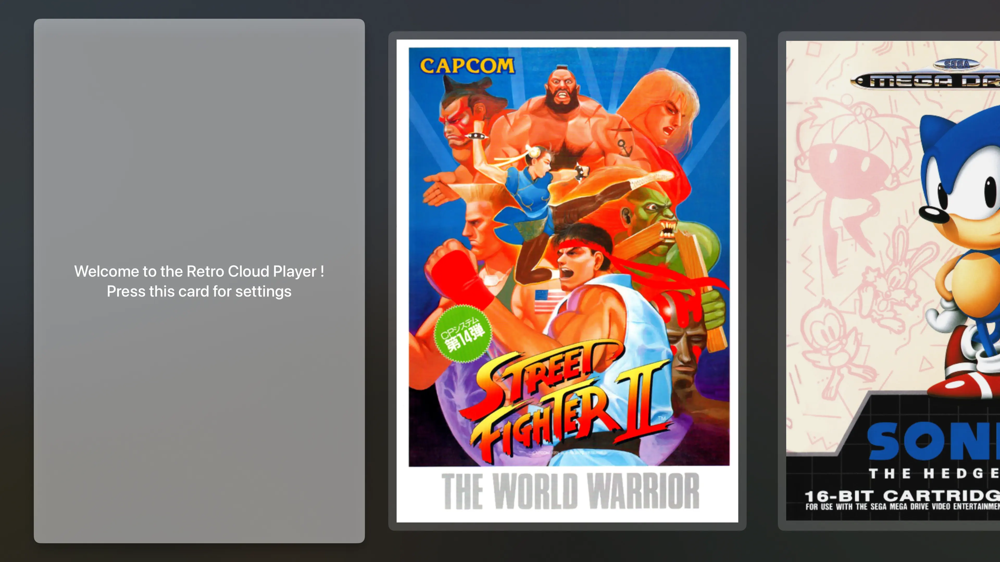

# Retro Cloud Companion

Retro Cloud Companion is a companion app for the Retro Cloud Player.
This app allow you to manage your collection of ROM stored in the cloud.

# Retro Cloud Player

The Retro Cloud Player is an emulator for legacy gaming systems.
The ROMs are stored in the cloud.
The Retro Cloud Companion app is needed in order to manage your collection of ROMs.
A gamepad or keyboard is also required.

This emulator include cores from the Libretro project.
            

